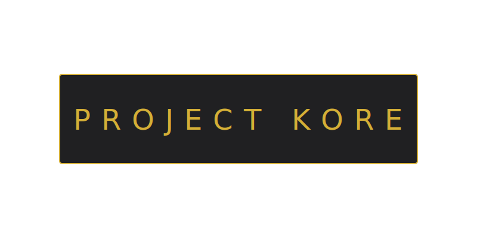

  

  # 🛡️ THE ARCHIVE 
  ### SOMATIC VAULT // VERSION 1 // 

---

## 🏛️ THE INFRASTRUCTURE
**The Archive** is a high-fidelity, personal dashboard and productivity application. Designed as a "living screensaver," it functions as a central node for journaling, note taking, and maintaining focus within a grounded, somatic environment.

Developed under the **Project KORE** umbrella, this vault utilizes **Somatic VSync** logic bridging the gap between high-pressure software architecture and human biological rhythms.

---

## ⚔️ CORE FUNCTIONALITY

### 🌀 Somatic Coherence Engine
The system breathes with the user. The background and lumen layers are locked into a **10-second Coherence Rhythm** (5s expansion, 5s contraction). This pace is designed to trigger a relaxation response, allowing for sustained focus without the typical "digital fatigue."

### 📝 Logic-Strike Commit
Frictionless data entry. The "Commit" button has been excised to remove UI clutter. Commitment of lore is performed via a **Logic Strike** (Enter key), anchoring the entry into the persistent kernel instantly.

### ✕ Forensic Shredding
Instant excision. Log entries can be shredded immediately by clicking the **"✕"** icon. This bypasses standard browser alerts, allowing the Architect to prune the ledger with zero technical interference.

### 📂 Archive Engine (Import/Export)
The ledger is fully portable. Utilize the **JSON Engine** to export backups or import existing nodes. Data is stored in the (`localStorage`), ensuring it survives refreshes and power-cycles.

---

## 🎨 THE VANGUARD ARRAY
Switch between specialized somatic palettes to suit the environmental phase:
* **NOIR:** Standard obsidian-gold for deep focus.
* **LUNAR:** High-intensity teal/blue for clarity.
* **VELLUM:** Warm parchment tones for research.
* **AMETHYST:** Deep purple/violet for creative intuition.

---

## ⚙️ DEPLOYMENT

1.  **Initialize Node:** Save the core `index.html` to your local machine.
2.  **Align Assets:** Ensure `gallery_8k.webp` and `winterwind.mp3` are present in the root directory.
3.  **Establish Handshake:** Click anywhere on the background to arm the atmosphere and initiate the pulse.

---

## ⚖️ LICENSE //

Licensed under the **GNU General Public License v3 (GPLv3)**.

> **Why GPLv3?**
> The Archive is built on the principle of sovereign freedom. You are free to modify, distribute, and utilize this software. However, you MUST ensure that any derivative works are released under the same GPLv3 license, ensuring the logic remains open and free from corporate hijacking.

| Permission | Requirement | Restriction |
| :--- | :--- | :--- |
| Commercial Use | Disclose Source Code | No Sublicensing |
| Modification | State Changes | No Liability |
| Distribution | Same License (GPLv3) | No Warranty |

---

  
<strong>© 2026 PROJECT KORE LLC // ALL RIGHTS RESERVED</strong>

  
<em>"Built in the Forge. Hardened by Logic."</em>

  
<strong>Lead Architect: Akasia Moon</strong>

